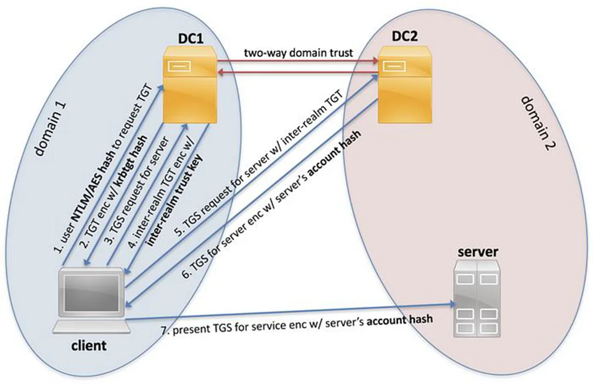

# TRUSTS

### First 30 days after create trusts between realms [ABUSE](https://blog.xpnsec.com/inter-realm-key-roasting/)

## Forged Trust Tickets 

<figure><figcaption></figcaption></figure>

Intended within forest. If 2 different forests, and 1 is owned, need check rights objects from 1st domain to 2nd

* [https://readmedium.com/r3d-buck3t/breaking-domain-trusts-with-forged-trust-tickets-5f03fb71cd72](https://medium.com/r3d-buck3t/breaking-domain-trusts-with-forged-trust-tickets-5f03fb71cd72)
* [https://redfoxsec.com/blog/domain-trusts-a-comprehensive-exploitation-guide/](https://redfoxsec.com/blog/domain-trusts-a-comprehensive-exploitation-guide/)
